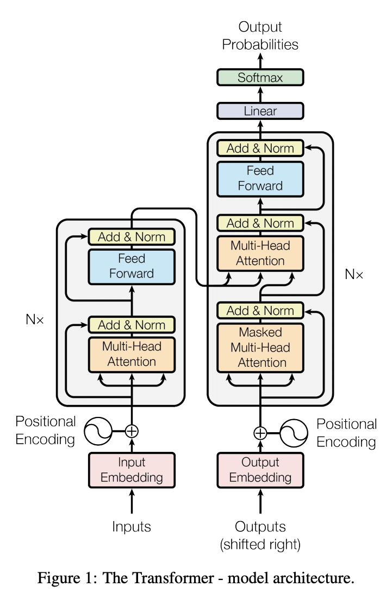
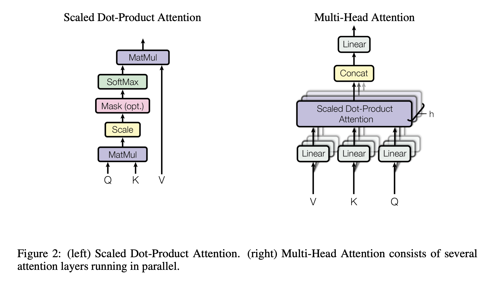

# Transformerを理解する - Attention Is All You Need

## 論文
- [Attention Is All You Need](https://arxiv.org/abs/1706.03762)

<div style="text-align: center;">
  
</div>


## 研究の特徴

- CNNやRNNを利用したモデルが主流だった自然言語処理界隈にAttentioのみで構成されたモデルを提案した
- RNNと異なり並列化しやすい
- BERTなど後発のモデルに大きな影響を与えた


## アーキテクチャ

エンコーダとデコーダともにN=6の6層からなる。エンコーダの各層は`Multi-Head Attention`と`Feed-Forward`から構成され、それぞれresidual構造を持つ。

<div style="text-align: center;">
  
</div>

### Scaled Dot-Product Attention

`Scaled Dot-Product Attention`はTransformer内で利用される自己注意機構の仕組みであり、以下の数式で定式化される。

<div style="text-align: center;">
  
</div>

`Scaled Dot-Product Attention`を定性的に理解すると、ある単語が系列内のどの単語と強い関係があるか(動詞とその目的語、または修飾語と就職される単語などの関係)を抽出するための自己注意機構である。

また自己注意機構は入力系列をに変換する関数である。系列の各要素x_i, y_iはそれぞれベクトル。

自己注意機構ではQ, K, Vは全て同じ要素であり(embedding_dim, num_sequences)の次元で構成される。まずは`QK^T`を計算して(embedding_dim, embedding_dim)の重み行列を得る。これはある単語から別の単語へどの単語が重要になるかを学習する機構であり、num_sequencesを表すで割ってsoftmaxを取ることで、Vにかけるべき重みを抽出する。その後softmaxから取得した重み行列とVの内積を計算して(embedding_dim, num_sequences)の行列を取得する。

一般に`additive attention`と`dot-product attention`では`dot-product attention`が高速に動作するが、が大きくなると`additive attention`の方がうまく機能する。原因としては内積の値が大きくなりすぎて、softmaxの勾配が極端に小さくなることが考えられるので、でスケーリングすることでそれを防ぎ、かつ高速に動作するよう工夫されている。

```python
class ScaledDotProductAttention(nn.Module):
    '''Scaled Dot-Product Attention'''

    def __init__(self, d_k: float):
        super().__init__()
        self.d_k: float = d_k

    def forward(
        self, q: Tensor, k: Tensor, v: Tensor, mask=None
    ) -> Tuple[Tensor, Tensor]:
        '''
        Args:
            q, k, v (Tensor): (batch_size, nun_sequences, embedding_dim).
        Returns:
            output (Tensor): Output of this layer. (batch, num_sequences, embed_dim)
            weights (Tensor): Attention weights. (batch, num_sequences, embed_dim)
        '''
        # -> (batch, num_seq, num_seq)
        weights = torch.matmul(q / self.d_k, k.transpose(1, 2))

        if mask is not None:
            weights = weights.masked_fill(mask == 0, -1e9)

        weights = F.softmax(weights, dim=2)
        # -> (batch, num_seq, embed_dim)
        output = torch.matmul(weights, v)
        return output, weights
```

### Multi-Head Attention

Transformerでは`Scaled Dot-Product Attention`を1つのheadとみなした`Multi-Head Attention`が各層に存在する。

処理の流れとしては入力からLinear, Scaled Dot-Product Attention, Concat, Linearであり、特徴的なのは入力をh=8つの異なるattention headに入力する箇所。


<div style="text-align: center;">
  
</div>

, , であり、自己注意機構ではd_k=d_v=64でありそれぞれK,Vの次元数を表す、h=8であるため最終出力はd_model=64*8=512次元となる。

単一のd_model次元のベクトルに対する単一の自己注意機構よりもこっちの方が性能が良かった。というのも異なるheadが異なる位置の処理を行いアンサンブル的な効果があるから。

### Position-wise Feed-Forward Networks


## Transformerの解説記事など
- [論文解説 Attention Is All You Need (Transformer) - ディープラーニングブログ](https://deeplearning.hatenablog.com/entry/transformer)
- [The Illustrated Transformer – Jay Alammar – Visualizing machine learning one concept at a time.](http://jalammar.github.io/illustrated-transformer/)
