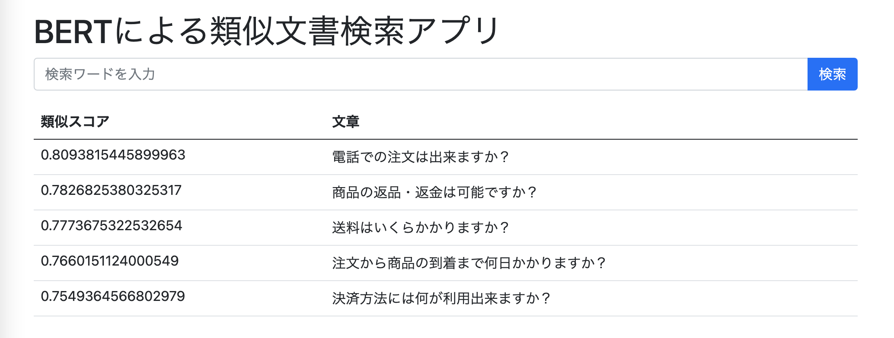

# BERT+ElasticSearchで類似文書検索

## 環境構築

- Docker ComposeでFastAPIとElasticSearchのサーバー起動
  - わりと時間がかかる

```shell
docker-compose -f docker/docker-compose.yaml up
```

- ElasticSearchのヘルスチェック

```shell
$ curl http://localhost:9200/_cat/health
1617722683 15:24:43 docker-cluster green 1 1 0 0 0 0 0 0 - 100.0%
```

`http://localhost:8000/`にアクセスすると以下のページに遷移する。



## 参考
- [jtibshirani/text-embeddings](https://github.com/jtibshirani/text-embeddings)
